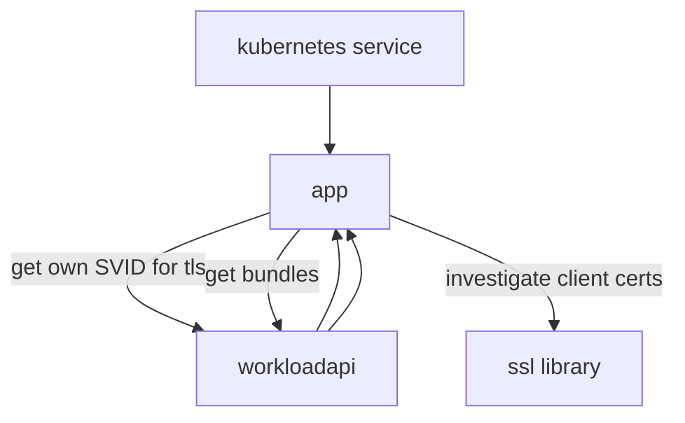
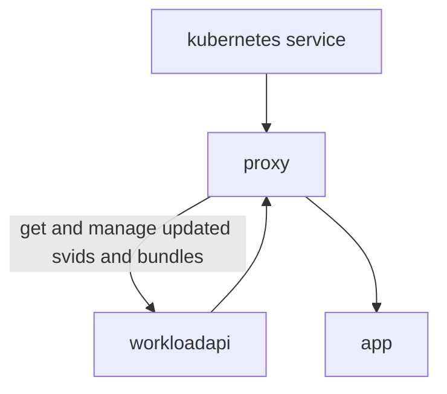

# SPIFFE AuthZ Proxy

A proxy designed to run as a sidecar container that provides SPIFFE-based X509
SVID authentication and authorization for inbound requests to an upstream HTTP
server.

## Before

The application has to interact with the workloadapi and SVIDs to serve
terminate TLS with an SVID and authenticate and authorize inbound requests:

The application also needs to manage certificate expiry and rotation, which can
introduce latency or concurrency challenges.

## After

The application doesn't need to know anything about SPIFFE, SVIDs, or the
workloadapi. The proxy terminates TLS with an appropriate SVID. Route (HTTP
method + path) based authorization is performed based on authenticated X509
SVIDs, and the SPIFFE ID is passed along as a plain HTTP header.

The application offloads managing SPIFFE authentication and route-based
authorization. Requests it processes are already authenticated and authorized.
It does not need to handle TLS termination.
