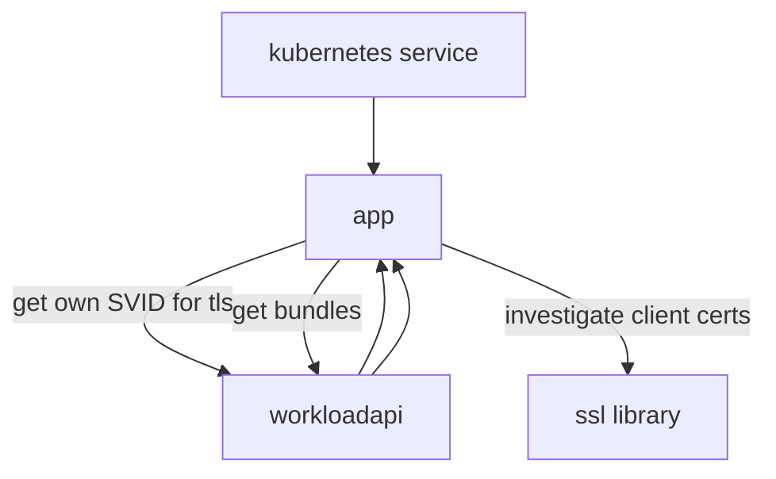
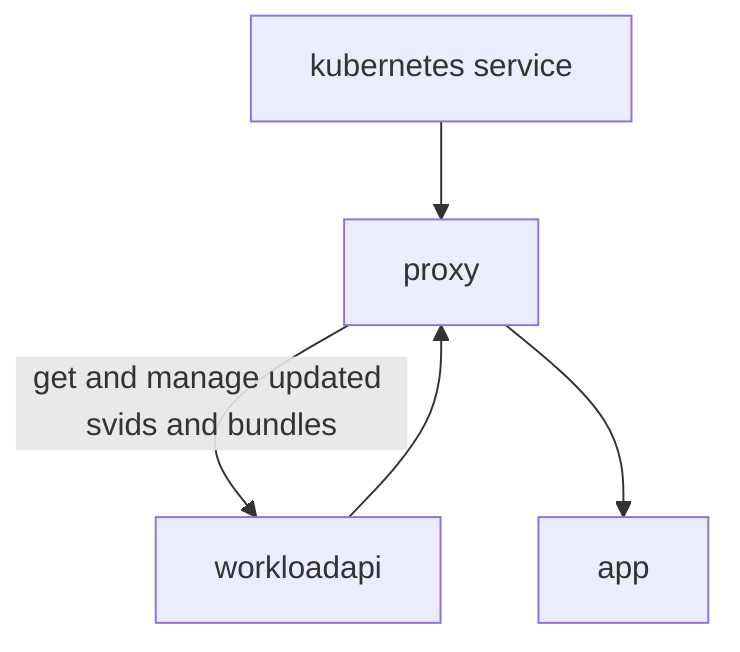

# SPIFFE AuthZ Proxy

A proxy designed to run as a sidecar container that provides SPIFFE-based X509
SVID authentication and authorization for inbound requests to an upstream HTTP
server.

## Before

The application has to interact with the workloadapi and SVIDs to serve
terminate TLS with an SVID and authenticate and authorize inbound requests:



The application also needs to manage certificate expiry and rotation, which can
introduce latency or concurrency challenges.

## After

The application doesn't need to know anything about SPIFFE, SVIDs, or the
workloadapi. The proxy terminates TLS with an appropriate SVID. Route (HTTP
method + path) based authorization is performed based on authenticated X509
SVIDs, and the SPIFFE ID is passed along as a plain HTTP header.



The application offloads managing SPIFFE authentication and route-based
authorization. Requests it processes are already authenticated and authorized.
It does not need to handle TLS termination.

## Configuration

Configuration is via environment variables. Most of them have reasonable
defaults. Only `AUTHZ_CONFIG` is required.

|env var|description|default|
|---|---|---|
| `AUTHZ_CONFIG` | Path to an authorization config file ([see below](#authz-config)). **Required**. | |
| `LOG_LEVEL` | Set the log level. Accepts Golang log/slog levels. | `INFO` |
| `LOG_FORMAT` | Set the log format. Accepts either `json` or `text`. | `json` |
| `BIND_ADDR` | The IP and port to bind and listen on. | `:8443` |
| `WORKLOAD_API` | The address (either `tcp://` with a network address and port, or `unix://` with a path to a socket) of the Workload API endpoint. | `unix:///tmp/spire-agent/public/agent.sock` |
| `UPSTREAM_ADDR` | The address (either `tcp://` with a network address and port, or `unix://` with a path to a socket) of the upstream server. | `tcp://127.0.0.1:8000` |

## AuthZ Config

The authorization rules are defined in an HCL-formatted file. `spiffeid` blocks
are the top level config, granting access to SVIDs with the given SPIFFE ID.
Under each `spiffeid` block, `path` blocks allow specific paths or patterns.
Within a `path` block, the `methods` array allows specific HTTP methods.

```hcl
# rules for requests with SVIDs for the spiffeid spiffe://example.org/workloads/workload-a
spiffeid "spiffe://example.org/workloads/workload-a" {
    # allows requests to exactly `/foo`
    path "/foo" {
        # allows GET and POST requests
        methods = ["GET", "POST"]
    }

    # allows requests to /widgets/1 but not /widgets/1/details
    path "/widgets/*" {
        # allows all request methods
        methods = ["*"]
    }

    # allows requests to any path starting with the prefix /sprockets/
    path "/sprockets/**" {
        # allow only GET, HEAD, and OPTIONS requests
        methods = ["GET", "HEAD", "OPTIONS"]
    }
}
```
